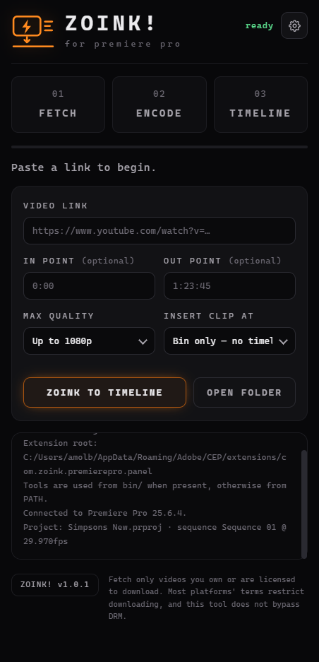

# ZOINK!

A Premiere Pro panel that turns a YouTube / Instagram / TikTok link into a clip on
your timeline. Paste a link, optionally set in and out points, click once — ZOINK
downloads it, conforms it to edit-safe H.264, imports it, and drops it where you
asked.

Need 40 seconds of a 3-hour VOD? Set the in/out points and only that section is
downloaded. No 3-hour download, no wasted disk.

<p align="center">
  
</p>

```
01 FETCH      yt-dlp, with byte-range section downloads
02 ENCODE     ffmpeg, variable frame rate -> constant frame rate H.264
03 TIMELINE   ExtendScript import + placement
```

> **Turn on browser cookies before your first grab.** YouTube now answers most
> anonymous requests with a bot check, and without a signed-in session downloads
> fail — sometimes as a plain "access denied", sometimes as a bare ffmpeg crash.
> See [Cookies and blocked videos](#cookies-and-blocked-videos).

## Requirements

- Premiere Pro 2022 or newer (built and tested against 2025)
- `yt-dlp` and `ffmpeg` (with `ffprobe`) — either on `PATH` or dropped into `bin/`

```bash
winget install yt-dlp.yt-dlp
```

```bash
winget install Gyan.FFmpeg
```

## Install for development

```bash
powershell -ExecutionPolicy Bypass -File scripts/install-dev.ps1
```

This sets `PlayerDebugMode` for CSXS 9–12 under `HKCU` (no admin rights needed) and
creates a directory junction from `%APPDATA%\Adobe\CEP\extensions\` to this repo, so
edits appear on the next panel reload.

Restart Premiere, then open **Window ▸ Extensions ▸ ZOINK!**

While the panel is open, the CEF debugger is at <http://localhost:8088>.

## Package for distribution

```bash
powershell -ExecutionPolicy Bypass -File scripts/package-zxp.ps1 -SignCmd C:\tools\ZXPSignCmd.exe -Password yourpassword
```

Produces `dist/ZOINK.zxp`, installable with the ZXP Installer or Anastasiy's
Extension Manager. `ZXPSignCmd` comes from
[Adobe-CEP/CEP-Resources](https://github.com/Adobe-CEP/CEP-Resources).

## How it fits together

The panel runs in two JavaScript worlds that can only talk through
`CSInterface.evalScript`:

| | |
| --- | --- |
| `client/` | Chromium + Node. UI, settings, spawning `yt-dlp` and `ffmpeg`, progress parsing. |
| `host/` | ExtendScript (ES3). Import, bin creation, track placement. |

Every call across the boundary is JSON, percent-encoded — video titles carry quotes
and Windows paths carry backslashes, both of which break naive string concatenation
into `evalScript`. Every host entry point returns a JSON string, because an uncaught
ExtendScript exception reaches the panel as the opaque text `EvalScript error.`

```
client/
  app.js                UI state machine, drives the three steps
  host-bridge.js        evalScript wrapper
  settings.js           %APPDATA%\ZOINK\settings.json
  log.js                console pane
  pipeline/
    proc.js             spawn, line buffering, process-tree kill
    tools.js            binary resolution: bin/ -> settings -> PATH
    timecode.js         in/out parsing
    probe.js            yt-dlp -J metadata, platform detection
    download.js         yt-dlp download, --download-sections, progress
    conform.js          ffprobe inspect, ffmpeg VFR -> CFR
    errors.js           raw stderr -> one actionable sentence
host/
  zoink.jsx             entry points: ping, getContext, place
  placement.jsx         bin, import, track and time resolution
  json2.jsx             JSON polyfill (ExtendScript has none)
```

### Why the encode step exists

It is not about the container. yt-dlp already merges to MP4. The step exists because
TikTok and Instagram serve **variable frame rate** video, which drifts out of sync as
it plays in a Premiere timeline. Anything already H.264 / yuv420p / AAC / CFR skips
the encode entirely, so a clean YouTube grab pays nothing for it.

## Cookies and blocked videos

**Recommended: turn on Use browser cookies in Settings ⚙ and leave it on.**

YouTube now answers most anonymous requests with a bot check, and Instagram and
TikTok need a session for anything that is not fully public. Signed out, the same
link can fail in several different-looking ways:

| What you see | What it actually is |
| --- | --- |
| `Sign in to confirm you're not a bot` | the bot check |
| `HTTP Error 403: Forbidden` | the bot check, on the media URL |
| `HTTP Error 429: Too Many Requests` | rate limiting, after a few anonymous pulls |
| `ffmpeg exited with code 3436169992` | a format yt-dlp only falls back to when signed out, which ffmpeg then fails to cut |

All four disappear with a signed-in session. ZOINK does try to recover on its own —
a blocked step is retried once with cookies from the first browser it finds, and the
setting is made permanent if that works — but enabling it up front avoids the failed
first attempt entirely.

Only browsers with a real profile on disk are offered. **Firefox is preferred**: it
is the only one that hands over cookies while still running. Chromium-based browsers
(Chrome, Edge, Brave) hold a lock on their cookie database and have to be closed
completely first.

You must be signed in to the site in that browser for this to help.

## Insert modes

| Mode | Behaviour |
| --- | --- |
| Append to end of sequence | Places after the last clip on the target video track |
| Playhead (overwrite) | Overwrites at the current playhead position |
| Playhead (insert & ripple) | Inserts at the playhead, rippling everything right |
| Bin only | Imports into the `ZOINK!` bin and stops |

With no sequence open, a timeline mode falls back to creating a new sequence from the
clip rather than failing.

## Settings

Stored at `%APPDATA%\ZOINK\settings.json`.

- **Download folder** — defaults to `ZOINK Downloads` next to the Premiere project,
  falling back to `~/Videos/ZOINK` when the project has never been saved
- **Frame-accurate cuts** — re-encodes cut boundaries so in/out land on the exact
  frame instead of the nearest keyframe. On by default; slower
- **Hardware encode (NVENC)** — only offered when the installed ffmpeg has
  `h264_nvenc`
- **Use browser cookies** — recommended for everything, required for private or
  age-restricted posts. See [Cookies and blocked videos](#cookies-and-blocked-videos)
- **Proxy**, **keep original download**, **bin name**, tool path overrides

## Legal

Fetch only videos you own or are licensed to download. Most platforms' terms restrict
downloading, and this tool does not bypass DRM.
